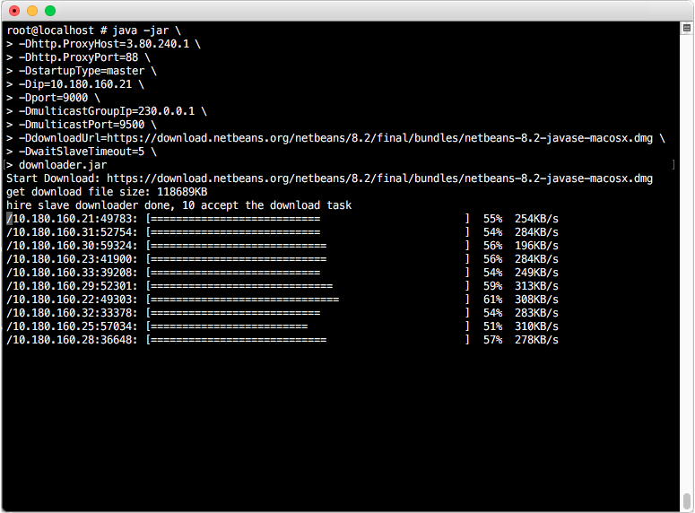

Downloader
---

Download the file via use the bandwidth of each of the PC that all in LAN to reach the maximum download speed.  
Deploy the __Downloader__ in LAN as much as possible and start it as slave downloader, then start a 
__Downloader__ as master, the master will dispatch the download task to each slave, the slave execute the task to 
download the part of the file and send the downloaded data back to master, the master will gather the all data that sent by slave 
and write it to file.  

Only support the `http` or `https` protocol now.



### Start as Slave
```
/usr/java/jdk1.8.0_162/bin/java -jar \
-Dhttp.ProxyHost=3.80.240.1 \
-Dhttp.ProxyPort=88 \
-DstartupType=slave \
-Dip=10.180.160.21 \
-DmulticastGroupIp=230.0.0.1 \
-DmulticastPort=9500 \
downloader.jar
```
### Start as Master 
```
/usr/java/jdk1.8.0_162/bin/java -jar \
-Dhttp.ProxyHost=3.80.240.1 \
-Dhttp.ProxyPort=88 \
-DstartupType=master \
-Dip=10.180.160.21 \
-Dport=9000 \
-DmulticastGroupIp=230.0.0.1 \
-DmulticastPort=9500 \
-DdownloadUrl=https://download.netbeans.org/netbeans/8.2/final/bundles/netbeans-8.2-javase-macosx.dmg \
-DwaitSlaveTimeout=5 \
/home/sg/lf489159/Downloads/downloader.jar
```